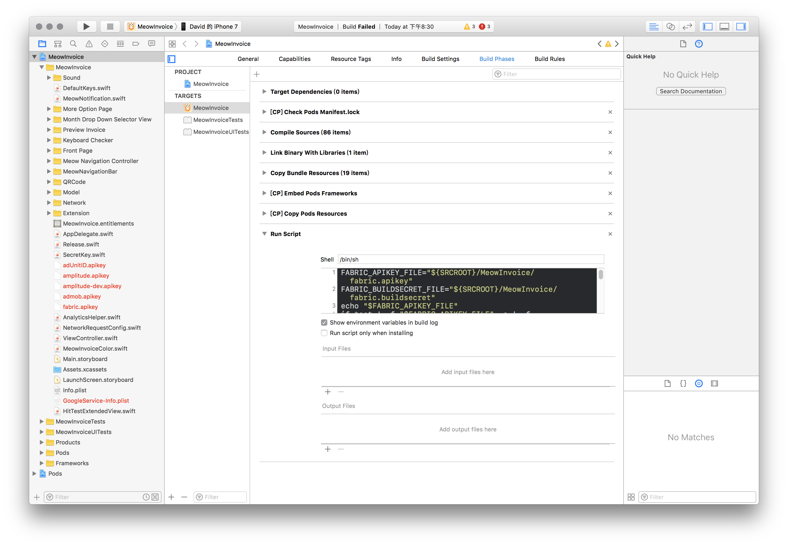
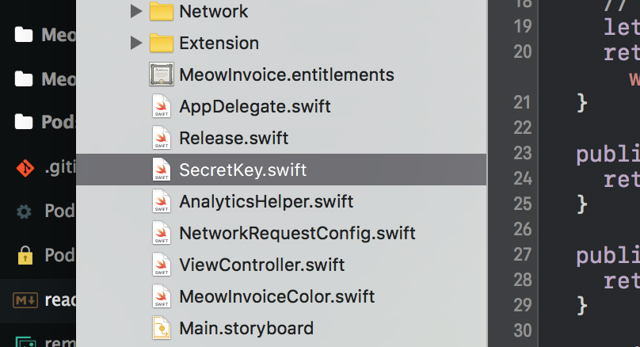
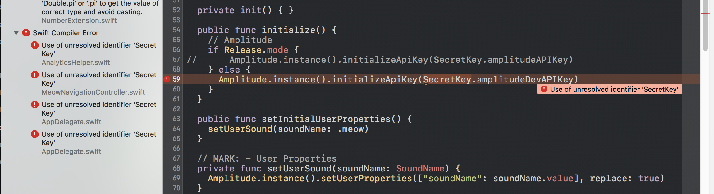
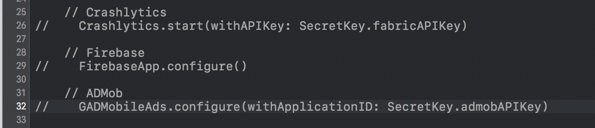

# 喵對發票
詳細請看：https://medium.com/@davidlin_98861/%E5%96%B5%E5%B0%8D%E7%99%BC%E7%A5%A8%E9%96%8B%E7%99%BC%E5%BF%83%E5%BE%97-3579693c328c

## Requirements
Xcode 8.0
Swift 3.0
Cocoapods 1.2

## Setup
Clone repo
```
$ git clone https://github.com/yoxisem544/MeowInvoice-iOS
```

Go to directory
```
$ cd ./MeowInvoice-iOS
```

Install dependencies
```
$ pod install
```

Open *.workspace
```
$ open MeowInvoice.xcworkspace/
```

Remove files marked red, remove run script.


Remove SecretKey.swift file


Comment out all errors, also firebase setup code in AppDelegate.



Then run the project!!
